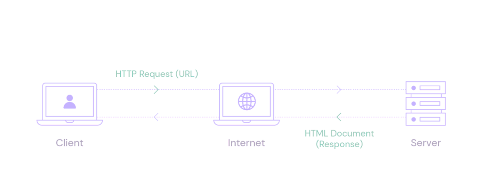
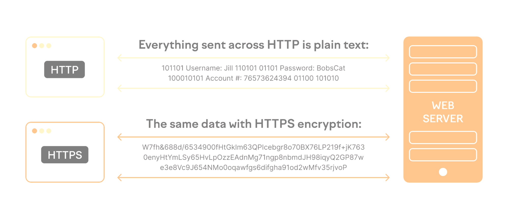
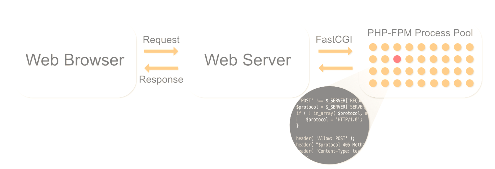
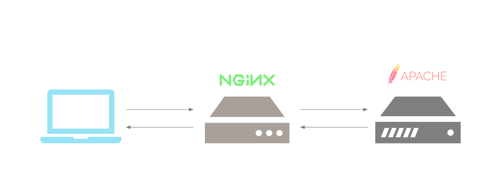

Apache Web Server and NGINX Web Server Infrastructure Deployment >> How to Install and Configure Apache Web Server + NGINX + PHP + HTTP HTTPS SSL/TLS Server Infrastructure Deployment
Topics:
- What is Apache HTTP Server and How to Install?
- Adjusting the Firewall + Checking your Web Server
- Managing the Apache Process
- Setting Up Virtual Hosts and Configuring Modules
- How to Configure Apache SSL - HTTPS Web Server
- What is PHP and PHP-FPM
- How to Install Apache with PHP-FPM
- Install Nginx as a Reverse Proxy for Apache + SSL


What is Apache HTTP Server and How to Install? Adjusting the Firewall + Checking your Web Server + Managing the Apache Process

The Apache HTTP Server, commonly referred to as Apache, is an open-source web server software developed and maintained by the Apache Software Foundation. It is one of the most widely used web servers globally. The Apache web server plays a crucial role in serving static and dynamic content over the World Wide Web.

Key features of the Apache web server include:

1. **Open Source:** Apache is open-source software, which means its source code is freely available to the public. This encourages collaboration, allows users to modify the code, and promotes a community-driven development model.

2. **Cross-Platform:** Apache is designed to work on various operating systems, including Unix, Linux, Windows, and more. This cross-platform compatibility makes it versatile and widely applicable.

3. **Module Support:** Apache's modular architecture allows users to extend its functionality by adding modules. These modules can provide additional features such as authentication mechanisms, URL rewriting, and support for various programming languages.

4. **Security:** Apache includes features for securing web servers, including support for SSL/TLS for encrypted communication, access control mechanisms, and various security modules.

5. **Performance:** Apache is known for its performance and scalability. It can handle a large number of concurrent connections and efficiently serve static and dynamic content.

6. **Configuration:** Apache's configuration files are flexible and allow administrators to customize the server settings based on their specific needs. The configuration files use a simple and human-readable syntax.

7. **Community Support:** As an open-source project, Apache benefits from a large and active community of developers and users. This community provides support, documentation, and contributes to the ongoing development of the software.

Apache is commonly used in conjunction with other software components, such as the PHP scripting language and the MySQL or PostgreSQL databases, to create a full web application stack. The combination of Apache, along with these technologies, is often referred to as the LAMP (Linux, Apache, MySQL/MariaDB, PHP/Perl/Python) stack.


**********
Apache Web Server Installation on Ubuntu 22.04 LTS (Desktop/Server) >> PC/VB/VM/Azure/AWS/GCP/... >>

Update Package Lists
```bash
sudo apt update -y
```

Install Apache
```bash
sudo apt install apache2 -y
```

If you want to, you can also install the Apache documentation and some Apache utilities. You’ll need the Apache utilities for some of the modules we’ll install later.
```bash
sudo apt-get install apache2-doc apache2-utils -y
```

Start Apache
After the installation is complete, Apache should start automatically. If it doesn't, you can start it manually with:
```bash
sudo systemctl start apache2
```

Enable Apache to Start on Boot
To ensure Apache starts automatically when your system boots up, run:
```bash
sudo systemctl enable apache2
```

Check Apache Status
You can check the status to ensure Apache is running without any issues:
```bash
sudo systemctl status apache2
```

Adjust Firewall Settings (if needed):
If you are running a firewall (e.g., UFW), you might need to allow traffic to the Apache service. You can enable the default Apache profile for UFW:
```bash
sudo ufw allow 'Apache'
```

Allow incoming SSH connections by adding a rule to the UFW configuration:
```bash
sudo ufw allow ssh
```

If UFW is not installed, you can install it and enable it with:
```bash
sudo apt install ufw -y
sudo ufw enable
```

After enabling UFW, you may want to check the status:
```bash
sudo ufw status
```

After making changes, reload UFW for the new rules to take effect:
```bash
sudo ufw reload
```
      
List the ufw application profiles by running the following:
```bash
sudo ufw app list
```

Access Apache Default Page
Open a web browser and navigate to `http://your_server_IP` or `http://localhost`. You should see the default Apache welcome page, indicating that Apache is successfully installed.
You can access the default Apache landing page to confirm that the software is running properly through your IP address. If you do not know your server’s IP address, you can get it a few different ways from the command line.
Try writing the following at your server’s command prompt:
```bash
hostname -I
```

Another option is to use the free icanhazip.com tool. This is a website that, when accessed, returns your machine’s public IP address as read from another location on the internet:
```bash
curl -4 icanhazip.com
```

To stop your web server, run:
```bash
sudo systemctl stop apache2
```

To stop and then start the service again, run:
```bash
sudo systemctl restart apache2
```

If you are simply making configuration changes, Apache can often reload without dropping connections. To do this, use the following command:
```bash
sudo systemctl reload apache2
```

By default, Apache is configured to start automatically when the server boots. If this is not what you want, disable this behavior by running:
```bash
sudo systemctl disable apache2
```





Apache Web Server - Setting Up Virtual Hosts and Configuring Modules

Create the directory for your_domain as follows:
```bash
sudo mkdir /var/www/your_domain
```

Example >> domain1.local
```bash
sudo mkdir /var/www/domain1.local
```

Next, assign ownership of the directory to the user you’re currently signed in as with the $USER environment variable:
```bash
sudo chown -R $USER:$USER /var/www/your_domain
```

Example >> domain1.local
```bash
sudo chown -R $USER:$USER /var/www/domain1.local
```

The permissions of your web root should be correct if you haven’t modified your umask value, which sets default file permissions. To ensure that your permissions are correct and allow the owner to read, write, and execute the files while granting only read and execute permissions to groups and others, you can input the following command:
```bash
sudo chmod -R 755 /var/www/your_domain
```

Example >> domain1.local
```bash
sudo chmod -R 755 /var/www/domain1.local
```

Next, create a sample index.html page using nano or your favorite editor:
```bash
sudo nano /var/www/your_domain/index.html
```

Example >> domain1.local
```bash
sudo vi /var/www/domain1.local/index.html
```

Inside, add the following sample HTML:
```bash
<html>
    <head>
        <title>Welcome to Your_domain!</title>
    </head>
    <body>
        <h1>Success!  The your_domain virtual host is working!</h1>
    </body>
</html>
```

Example >> domain1.local
```bash
<html>
    <head>
        <title>Welcome to domain1.local!</title>
    </head>
    <body>
        <h1>Success!  The domain1.local virtual host is working!</h1>
    </body>
</html>
```

In order for Apache to serve this content, it’s necessary to create a virtual host file with the correct directives. Instead of modifying the default configuration file located at /etc/apache2/sites-available/000-default.conf directly, make a new one at /etc/apache2/sites-available/your_domain.conf:
```bash
sudo nano /etc/apache2/sites-available/your_domain.conf
```

Example >> domain1.local
```bash
sudo vi /etc/apache2/sites-available/domain1.local.conf
```

Add in the following configuration block, which is similar to the default, but updated for your new directory and domain name:
```bash
<VirtualHost *:80>
    ServerAdmin webmaster@localhost
    ServerName your_domain
    ServerAlias www.your_domain
    DocumentRoot /var/www/your_domain
    ErrorLog ${APACHE_LOG_DIR}/error.log
    CustomLog ${APACHE_LOG_DIR}/access.log combined
</VirtualHost>
```

Example >> domain1.local
```bash
<VirtualHost *:80>
    ServerAdmin webmaster@domain1.local
    ServerName domain1.local
    ServerAlias domain1.local
    DocumentRoot /var/www/domain1.local
    ErrorLog ${APACHE_LOG_DIR}/error.log
    CustomLog ${APACHE_LOG_DIR}/access.log combined
</VirtualHost>
```

Notice that we’ve updated the DocumentRoot to our new directory and ServerAdmin to an email that the your_domain site administrator can access. We’ve also added two directives: ServerName, which establishes the base domain that will match this virtual host definition, and ServerAlias, which defines further names that will match as if they were the base name.

Now enable the file with the a2ensite tool:
```bash
sudo a2ensite your_domain.conf
```

Example >> domain1.local
```bash
sudo a2ensite domain1.local.conf
```

Disable the default site defined in 000-default.conf:
```bash
sudo a2dissite 000-default.conf
```

Next, test for configuration errors:
```bash
sudo apache2ctl configtest
```

Restart Apache to implement your changes:
```bash
sudo systemctl restart apache2
```

Apache will now be serving your domain name. You can test this by navigating to http://your_domain, where you will see something like the following:

/var/www/html: The actual web content, which by default only consists of the default Apache page you saw earlier, is served out of the /var/www/html directory. This can be changed by altering Apache configuration files.
```bash
ls -anp /var/www/html
```

/etc/apache2: The Apache configuration directory. All of the Apache configuration files reside here.
```bash
ls -anp /etc/apache2
```

/etc/apache2/apache2.conf: The main Apache configuration file. This can be modified to make changes to the Apache global configuration. This file is responsible for loading many of the other files in the configuration directory.
```bash
cat /etc/apache2/apache2.conf
```

/etc/apache2/ports.conf: This file specifies the ports that Apache will listen on. By default, Apache listens on port 80 and additionally listens on port 443 when a module providing SSL capabilities is enabled.
```bash
cat /etc/apache2/ports.conf
```

/etc/apache2/sites-available/: The directory where per-site virtual hosts can be stored. Apache will not use the configuration files found in this directory unless they are linked to the sites-enabled directory. Typically, all server block configuration is done in this directory and then enabled by linking to the other directory with the a2ensite command.
```bash
ls -anp /etc/apache2/sites-available/
```

/etc/apache2/sites-enabled/: The directory where enabled per-site virtual hosts are stored. Typically, these are created by linking to configuration files found in the sites-available directory with the a2ensite. Apache reads the configuration files and links found in this directory when it starts or reloads to compile a complete configuration.
```bash
ls -anp /etc/apache2/sites-enabled/
```

/etc/apache2/conf-available/, /etc/apache2/conf-enabled/: These directories have the same relationship as the sites-available and sites-enabled directories but are used to store configuration fragments that do not belong in a virtual host. Files in the conf-available directory can be enabled with the a2enconf command and disabled with the a2disconf command.

/etc/apache2/mods-available/, /etc/apache2/mods-enabled/: These directories contain the available and enabled modules, respectively. Files ending in .load contain fragments to load specific modules, while files ending in .conf contain the configuration for those modules. Modules can be enabled and disabled using the a2enmod and a2dismod commands.

/var/log/apache2/access.log: By default, every request to your web server is recorded in this log file unless Apache is configured to do otherwise.
```bash
tail /var/log/apache2/access.log
```

/var/log/apache2/error.log: By default, all errors are recorded in this file. The LogLevel directive in the Apache configuration specifies how much detail the error logs will contain.
```bash
tail /var/log/apache2/error.log
```

To list all installed Apache modules on Ubuntu and search for additional modules, you can use the following commands.
To list the currently loaded Apache modules, you can use the `apachectl` command with the `-M` option:
```bash
apachectl -M
```

Or, you can use the following command with `apache2ctl`:
```bash
apache2ctl -M
```
This will display a list of loaded modules.

To search for available Apache modules that you can install, you can use the `apt search` command. For example:
```bash
apt search libapache2-mod
```
This will display a list of available Apache modules. The `libapache2-mod` prefix is commonly used for Apache modules in the package manager.

To install a specific Apache module, you can use the `apt-get install` command.
```bash
sudo apt-get install libapache2-mod-mapcache -y
sudo apt-get install libapache2-mod-php -y
sudo apt-get install libapache2-mod-php7.4 -y
```

After installing a new module, you need to enable it using the `a2enmod` command. For example:
```bash
sudo a2enmod mapcache
```

Enable rewrites/redirects using the mod_rewrite module
This module is used for rewrites (redirects), as the name suggests. You’ll need it if you use WordPress or any other CMS for that matter. To install it, just run:
```bash
sudo a2enmod rewrite
```

Secure your Apache with the ModSecurity module
ModSecurity is a module used for security, again, as the name suggests. It basically acts as a firewall, and it monitors your traffic. To install it, run the following command:
```bash
sudo apt-get install libapache2-mod-security2 -y
```

If the above command doesn't work, you can try searching for the available ModSecurity package:
```bash
sudo apt search libapache2-mod-security
```
This will show you a list of available packages related to ModSecurity. Look for the appropriate package and install it using `apt-get`.

After installing the ModSecurity module, you may also need to enable it. On newer versions of Ubuntu and Apache, you can use `a2enmod`:
```bash
sudo a2enmod security2
```

After enabling the module, you may need to restart Apache for the changes to take effect:
```bash
sudo systemctl restart apache2
```
Please note that the specific module names and commands may vary depending on the version of Apache and the available packages in your Ubuntu release. Always check the documentation or package manager for the most accurate information.

To list the enabled modules on Apache in Ubuntu, you can use the `a2query` command. Specifically, the `-m` option can be used to list the enabled modules. Open a terminal and run the following command:
```bash
sudo a2query -m
```
This will display a list of currently enabled Apache modules. The output will show the names of the enabled modules.

Block DDoS attacks using the mod_evasive module
You can use the mod_evasive module to block and prevent DDoS attacks on your server, though it’s debatable how useful it is in preventing attacks. To install it, use the following command:
```bash
sudo apt-get install libapache2-mod-evasive -y
```
By default, mod_evasive is disabled, to enable it, edit the following file:
```bash
sudo vi /etc/apache2/mods-enabled/evasive.conf
```
And uncomment all the lines (remove #) and configure it per your requirements. You can leave everything as-is if you don’t know what to edit.
And create a log file:
```bash
sudo mkdir /var/log/mod_evasive 
sudo chown -R www-data:www-data /var/log/mod_evasive
sudo systemctl restart apache2
```

Example for domain1.local - How to Test and Verify?! >>
Add domain1.local >> /etc/hosts
```bash
sudo vi /etc/hosts
```
To verify the response of a website using `curl` on Ubuntu, you can use the following command:
```bash
curl -I http://domain1.local
```
This command sends a HEAD request to the specified URL (`http://domain1.local` in this case) and displays the headers of the HTTP response. The `-I` option tells `curl` to show only the headers.
If you want to see the complete HTTP response (including headers and the response body), you can use:
```bash
curl http://domain1.local
```
Replace `http://domain1.local` with the actual URL you want to test. Make sure that the specified domain is accessible from your machine and that your machine can resolve the domain to the correct IP address.
If you encounter SSL/TLS-related issues or if the website uses HTTPS, you might need to use the `-k` option with `curl` to ignore SSL certificate verification (not recommended for production use):
```bash
curl -kI https://domain1.local
```
Remember to replace `https://domain1.local` with the actual HTTPS URL you want to test.
These `curl` commands can help you inspect the HTTP headers and content returned by the web server for the specified URL.

Important Note: Hostfile >> Windows >> Location: C:\Windows\System32\drivers\etc >> Add domain1.local with ip address in this file (example) >> Using notepad and run as admin

Important Note: Hostfile >> Linux >> Location /etc/hosts >> Add domain1.local with ip address in this file (example)

```bash
sudo apt install net-tools -y
```

```bash
netstat -tupln
```





How to Configure Apache SSL - HTTPS Web Server

Example for domain1.local >> 

Generate Apache SSL certificate files
To obtain the SSL certificate files, a “Certificate Signing Request” (CSR) is executed. The CSR process associates the domain name with identifying characteristics of the organization and a cryptographic key. Depending on the certificate provider, the CSR is executed either via a web interface or from the command line. We’ll show an example of a certificate signing request via OpenSSL:
```bash
sudo openssl req -x509 -nodes -days 365 -newkey rsa:2048 -keyout domain1.key -out domain1.crt
```

When the command is executed, information is requested and a handful of files are created. Here’s an overview of the files created when the Certificate Signing Request (CSR) is executed, including file extensions:
Private key >> .key >> Used to generate CSR and later secure and verify connections using the certificate.
CSR file >> .csr >> Required to order the SSL certificate.
Intermediate SSL Certificate >> .crt >> Certificate that enables a certificate authority to issue additional certificates.

To set up Apache SSL, the certificate files are placed on the server. Usually, there are two to three files:
- Private key
- Primary SSL certificate
- Intermediate SSL certificate, if applicable
Put these files in their own folder and make sure they are readable by the root user only. From the command line, use the following steps:
Create folder for certificate files:

Example for domain1.local
```bash
sudo mkdir -p /root/cert/
```

Copy certificate files to folder:
```bash
sudo cp domain1.crt /root/cert/
sudo cp domain1.key /root/cert/
```

```bash
sudo ls -anp /root/cert
```

Customize users and permissions to make folders and files readable only by root:
```bash
sudo chown -R root:root /root/cert/
sudo chmod -R 400 /root/cert/
sudo chmod 500 /root/cert/
```

```bash
cat /etc/apache2/sites-available/domain1.local.conf
```

Now duplicate the HTTP VHost block, adjust the port to 443, and add the Apache SSL-specific settings:
```bash
sudo vi /etc/apache2/sites-available/domain1.local.ssl.conf
```

```bash
<VirtualHost *:443>
    ServerAdmin webmaster@domain1.local
    ServerName domain1.local
    SSLEngine on
    SSLCertificateFile /root/cert/domain1.crt
    SSLCertificateKeyFile /root/cert/domain1.key
    ServerAlias domain1.local
    DocumentRoot /var/www/domain1.local
    ErrorLog ${APACHE_LOG_DIR}/error.log
    CustomLog ${APACHE_LOG_DIR}/access.log combined
</VirtualHost>
```

After this, we need to enable the SSL version of your site. We can run this command to enable the site:
```bash
sudo a2ensite yourdomain.com-ssl.conf
```

```bash
sudo a2ensite domain1.local.ssl.conf
```

```bash
sudo a2enmod ssl
```

Open your Apache configuration file for editing. The main configuration file is typically located at `/etc/apache2/apache2.conf`. You can use a text editor, such as `nano` or `vim`:
```bash
sudo vi /etc/apache2/apache2.conf
```

Add the following line at the end of the file to set the global `ServerName`:
```bash
ServerName localhost
```
Replace "localhost" with the actual FQDN or domain name of your server if you have one. If you don't have a specific domain, setting it to "localhost" is a common practice for development environments.

```bash
tail /etc/apache2/apache2.conf
```

Test Apache SSL functionality 
```bash
sudo apachectl configtest
```
If this command does not work, try the alternative command 'apache2ctl':
```bash
sudo apache2ctl configtest
```
Or check your apache2 configuration by running this command:
```bash
sudo apache2ctl -t
```

If the test was successful, restart the Apache server:
```bash
sudo apachectl restart
```

```bash
sudo systemctl restart apache2
```

Allow Incoming HTTPS Traffic:
Allow incoming traffic on port 443 (HTTPS):
```bash
sudo ufw allow 443
```

```bash
sudo ufw status
sudo ufw app list
```

You can also run the command below to check if the SSL version of your website is enabled or not.
```bash
sudo apachectl -S
```

After the Apache server restarts with customized configuration, test the SSL connection. To do this, open the site in at least two different browsers.





What is PHP and PHP-FPM and How to Install Apache with PHP-FPM

PHP (Hypertext Preprocessor) is a widely-used open-source server-side scripting language. It is especially suited for web development and can be embedded into HTML. PHP is commonly used to create dynamic web pages, process forms, manage databases, and perform other server-side tasks.

PHP-FPM stands for "PHP FastCGI Process Manager." It is a separate and highly efficient process manager for PHP. FastCGI (Fast Common Gateway Interface) is a protocol that enables a web server to communicate with external applications, such as PHP, to handle dynamic content generation. PHP-FPM works as a FastCGI server for PHP, managing processes and handling requests from a web server.

Here are some key points about PHP-FPM:

1. **Process Management:** PHP-FPM manages pools of PHP worker processes. Each pool can have its configuration settings, allowing for fine-grained control over how PHP processes are handled.

2. **Performance:** PHP-FPM is designed to be highly efficient and scalable. It can handle a large number of simultaneous connections and requests, making it suitable for high-traffic websites.

3. **Isolation:** PHP-FPM provides process isolation, meaning that each PHP pool runs independently of others. This helps prevent issues in one pool from affecting others, enhancing the overall stability of a web server.

4. **Resource Management:** PHP-FPM allows for the management of resources, such as setting limits on the number of processes, controlling memory usage, and adjusting various performance-related settings.

5. **Integration with Web Servers:** PHP-FPM can be integrated with various web servers, including Nginx and Apache, allowing these servers to offload PHP processing to the PHP-FPM process manager.

Overall, PHP-FPM is a crucial component for optimizing the performance and scalability of PHP applications in a web server environment. It provides a robust and efficient way to manage PHP processes, ensuring better handling of dynamic content and improved overall performance.

Apache and PHP-FPM are both widely used in web development to serve dynamic content. While Apache is the most popular web server used today, PHP-FPM is a FastCGI process manager that provides a faster and more efficient way to process PHP requests. Combining the two can significantly improve the performance of a website.

Before installing any new software, you should update your system to ensure that all packages are up to date. You can do this by running the following command in the terminal:
```bash
sudo apt update && sudo apt upgrade -y
```

Install PHP-FPM
The default repositories may not contain the latest PHP version packages. So we always prefer to use ondrej/php PPA for installing PHP that contains most of the versions.
To configure PPA, run the following commands:
```bash
sudo add-apt-repository ppa:ondrej/php
```
Then install the PHP along with PHP-FPM, by running the following command in the terminal:
```bash
sudo apt install php8.2 php8.2-fpm -y
```
Note: Replace “8.2” with the required PHP versions (Like: 8.1, 7.4, 7.3, etc). 

Once the installation is complete, you can start the PHP-FPM service by running the following command:
```bash
sudo systemctl start php8.2-fpm
```

You can also enable PHP-FPM to start at boot time by running the following command:
```bash
sudo systemctl enable php8.2-fpm
```

Configure Apache to use PHP-FPM
To configure Apache to use PHP-FPM, you need to enable the “proxy_fcgi” and “proxy” modules. You can do this by running the following command:
```bash
sudo a2enmod proxy_fcgi proxy
```

Example >> domain2.local
Create a new configuration file for your virtual host using the following command:
```bash
sudo vi /etc/apache2/sites-available/domain2.local.conf
```
Note: Replace “domain2.local” with your domain name. 

Inside the new configuration file, add the following configuration with PHP-FPM:
```bash
<VirtualHost *:80>
    ServerName domain2.local
    ServerAlias domain2.local
    DocumentRoot /var/www/domain2.local
    <Directory /var/www/domain2.local>
        Options -Indexes +FollowSymLinks +MultiViews
        AllowOverride All
        Require all granted
    </Directory>
    <FilesMatch \.php$>
        SetHandler "proxy:unix:/run/php/php8.2-fpm.sock|fcgi://localhost/"
    </FilesMatch>
    ErrorLog ${APACHE_LOG_DIR}/error.log
    CustomLog ${APACHE_LOG_DIR}/access.log combined
</VirtualHost>
```

Enable the new virtual host by running the following command:
```bash
sudo a2ensite domain2.local.conf
```

Reload the Apache web server to apply the changes:
```bash
sudo systemctl reload apache2 
```

```bash
sudo mkdir -p /var/www/domain2.local/
```

To test the Apache with PHP-FPM configuration, create a new PHP file in the document root directory of your website:
```bash
sudo vi /var/www/domain2.local/index.php
```

Add the following lines to the file:
```bash
<?php phpinfo(); ?>
```

Then, open your web browser and navigate to “http://domain2.local/”. If everything is configured correctly, you should see the PHP information page.

```bash
php -v
```





Apache Web Server - Install Nginx as a Reverse Proxy for Apache + SSL

Nginx is a powerful and widely-used open-source web server and reverse proxy server software. Originally developed to address the challenge of handling 10,000 simultaneous connections problem. Nginx has become popular for its performance, scalability, and versatility.

Here are two primary roles of Nginx:

1. **Web Server:**
   - Nginx can serve static content like HTML, CSS, and images directly to clients.
   - It is known for its efficiency in handling a large number of simultaneous connections and requests.

2. **Reverse Proxy:**
   - Nginx can act as a reverse proxy, sitting between client devices and backend servers.
   - In a reverse proxy setup, Nginx receives client requests and forwards them to the appropriate backend server. It then takes the response from the backend server and sends it back to the client.
   - This architecture has several advantages, including load balancing, improved security, and easier management of backend server resources.

**Nginx Reverse Proxy:**
A reverse proxy is a server that sits between client devices and backend servers, forwarding client requests to the servers and returning the servers' responses to clients. Here are some common use cases for Nginx as a reverse proxy:

1. **Load Balancing:**
   - Nginx can distribute incoming client requests among multiple backend servers to balance the load. This helps ensure that no single server becomes overwhelmed, improving overall system performance and reliability.

2. **SSL Termination:**
   - Nginx can handle SSL/TLS encryption and decryption, offloading this process from backend servers. This is known as SSL termination, and it helps reduce the computational load on backend servers.

3. **Security:**
   - Acting as a reverse proxy, Nginx can provide an additional layer of security by hiding the internal structure of your network and servers. It can also filter and block malicious requests.

4. **Caching:**
   - Nginx can cache static content or even dynamic content for a certain period. This helps reduce the load on backend servers and improves response times for frequently requested content.

5. **HTTP Acceleration:**
   - Nginx can be used to accelerate HTTP requests by serving static content directly and forwarding dynamic content requests to backend servers.

Nginx is a versatile web server and reverse proxy that plays a crucial role in improving the performance, scalability, and security of web applications. Its flexibility makes it suitable for a wide range of scenarios, from serving static content to complex load balancing setups.

Using Nginx as a reverse proxy alongside Apache offers a range of benefits that significantly enhance website performance, security, and compatibility. Nginx's efficient resource utilization, with each process thread capable of handling numerous concurrent user connections, reduces context switching, CPU consumption, and RAM usage compared to Apache, resulting in improved server speeds and scalability. 

The enhanced security features of Nginx, particularly its ability to safeguard against DDoS and DoS attacks, make it a valuable shield when placed in front of an Apache web server. 

Moreover, the combination of Nginx's prowess in handling static content and Apache's excellence in serving dynamic content results in optimal overall performance. 

Nginx can also function as a load balancer, evenly distributing incoming traffic across multiple Apache servers to prevent overload. This compatibility ensures that web applications designed for Apache can still be utilized, allowing users to benefit from the strengths of both servers and creating a high-performing and secure environment for websites or applications.

First >> Changing Apache Default Port Number from 80 and 443 to X and Y

To check which port number Apache is running on using `netstat` or `ps aux` commands, you can follow these steps:
Run the following command to list all the listening ports and their associated processes:
```bash
sudo netstat -tuln
```

Run the following command >> to check if apache running or not!
```bash
ps aux | grep apache
```

Change the port number from 80 and 443 >> to 8080 and 4443 (example) >> apache2 >> ports.conf
```bash
cat /etc/apache2/ports.conf
```
```bash
sudo vi /etc/apache2/ports.conf
```
Change the port numbers from 80 and 443 to another number and save the config files

To list all apache sites available
```bash
ls -anp /etc/apache2/sites-available/
```

Example for >> domain1.local and domain2.local and apache default config files
Change the port number from 80 and 443 >> to 8080 and 4443 (example)
```bash
sudo vi /etc/apache2/sites-available/000-default.conf
```
```bash
sudo vi /etc/apache2/sites-available/default-ssl.conf
```
```bash
sudo vi /etc/apache2/sites-available/domain1.local.conf
```
```bash
sudo vi /etc/apache2/sites-available/domain1.local.ssl.conf
```
```bash
sudo vi /etc/apache2/sites-available/domain2.local.conf
```

```bash
sudo apachectl configtest
```

```bash
sudo service apache2 restart
```

```bash
sudo apachectl -S
```

```bash
sudo netstat -tuln
```

Setting Up an Nginx Reverse Proxy with Apache
The first step in setting up an Nginx reverse proxy with Apache is to install Nginx on your server. Most Linux distributions have Nginx available in their package repositories, making installation simple. For example, on Ubuntu, you can install Nginx using the following command:
```bash
sudo apt-get install nginx -y
```

Once Nginx is installed, you’ll need to disable the default virtual host configuration. This can be done by removing the default symbolic link in the sites-enabled directory:
```bash
sudo rm /etc/nginx/sites-enabled/default
```

Creating the Nginx Reverse Proxy Configuration File
Next, you’ll need to create a new Nginx reverse proxy configuration file. This file will contain the necessary directives to forward incoming traffic to your Apache server. Create a new file called reverse-proxy.conf in the /etc/nginx/sites-available directory:
```bash
sudo vi /etc/nginx/sites-available/reverse-proxy.conf
```

In this file, you’ll define the server block for your Nginx reverse proxy. The following example demonstrates a basic configuration that forwards incoming traffic on port 80 to an Apache server listening on port 8080:
Example for domain1.local and domain2.local >>
```bash
server {
    listen 80;
    server_name domain1.local;

    location / {
        proxy_pass http://domain1.local:8080;
        proxy_set_header Host $host;
        proxy_set_header X-Real-IP $remote_addr;
        proxy_set_header X-Forwarded-For $proxy_add_x_forwarded_for;
    }
}

server {
    listen 80;
    server_name domain2.local;

    location / {
        proxy_pass http://domain2.local:8080;
        proxy_set_header Host $host;
        proxy_set_header X-Real-IP $remote_addr;
        proxy_set_header X-Forwarded-For $proxy_add_x_forwarded_for;
    }
}

```

Configuring the proxy_pass Directive
The proxy_pass directive is the core of your Nginx reverse proxy configuration. It specifies the destination of the proxied requests, which in this case is your Apache server. In the example above, the Apache server is listening on localhost:8080. Adjust this value as needed to match your own Apache server’s address and port number.
Once you’ve finished editing the reverse-proxy.conf file, save and close it. Then, create a symbolic link to the sites-enabled directory to enable the configuration:
```bash
sudo ln -s /etc/nginx/sites-available/reverse-proxy.conf /etc/nginx/sites-enabled/
```

```bash
ls -anp /etc/nginx/sites-enabled/
```

```bash
sudo cat /etc/hosts
```
Add domain1.local and domain2.local (example) in hosts file >> ip address 127.0.0.1
```bash
sudo vi /etc/hosts
```
```bash
127.0.0.1  domain1.local
127.0.0.1  domain2.local
```

Finally, restart Nginx to apply the changes:
```bash
sudo service nginx restart
```

```bash
sudo netstat -tuln
```

Testing Your Nginx Reverse Proxy Setup
To test your Nginx reverse proxy setup, try accessing your domain in a web browser. If everything is configured correctly, you should see the content served by your Apache server. To confirm that Nginx is acting as a reverse proxy, you can check the Nginx access logs for entries containing the X-Forwarded-For header:
```bash
sudo tail /var/log/nginx/access.log
```

Nginx Reverse Proxy Configuration + Cache
```bash
sudo vi /etc/nginx/sites-available/reverse-proxy.conf
```

Nginx cache configuration >> Example for domain1.local and domain2.local >>
```bash
proxy_cache_path        /var/www/cache levels=1:2 keys_zone=my-cache:10m max_size=10g inactive=600m;
proxy_temp_path         /var/www/cache/tmp;
proxy_connect_timeout   600;
proxy_send_timeout      600;
proxy_read_timeout      600;
send_timeout            600;
proxy_cache_key         $scheme$host$request_uri;
proxy_buffers           256 16k;
proxy_buffer_size       32k;
proxy_set_header        Proxy "";
proxy_set_header        X-Forwarded-For $proxy_add_x_forwarded_for;
server {
        listen 80;
        server_name domain1.local;
        set $skip_cache 0;
        set $skip_reason "";
        location / {
                proxy_pass http://domain1.local:8080;
                proxy_set_header Host $host;
                proxy_set_header X-Real-IP $remote_addr;
                proxy_set_header X-Forwarded-For $proxy_add_x_forwarded_for;
                proxy_cache my-cache;
                proxy_cache_revalidate on;
                proxy_ignore_headers Expires Cache-Control;
                proxy_cache_use_stale error timeout invalid_header updating http_500 http_502 http_503 http_504;
                proxy_cache_bypass $skip_cache;
                proxy_no_cache $skip_cache;
                proxy_cache_valid 200 301 302 5m;
                proxy_cache_valid 404 1m;
        }
}
server {
        listen 80;
        server_name domain2.local;
        set $skip_cache 0;
        set $skip_reason "";
        location / {
                proxy_pass http://domain2.local:8080;
                proxy_set_header Host $host;
                proxy_set_header X-Real-IP $remote_addr;
                proxy_set_header X-Forwarded-For $proxy_add_x_forwarded_for;
                proxy_cache my-cache;
                proxy_cache_revalidate on;
                proxy_ignore_headers Expires Cache-Control;
                proxy_cache_use_stale error timeout invalid_header updating http_500 http_502 http_503 http_504;
                proxy_cache_bypass $skip_cache;
                proxy_no_cache $skip_cache;
                proxy_cache_valid 200 301 302 5m;
                proxy_cache_valid 404 1m;
        }
}
```

```bash
sudo service nginx restart
```

```bash
sudo apt-get install curl -y
```

```bash
curl -I http://domain1.local
```

```bash
curl -I http://domain2.local
```

```bash
sudo ls -anp /var/www/cache/
```

Configuring Apache mod_rpaf
When using Nginx as a reverse proxy, it’s important to configure Apache to recognize the X-Forwarded-For header. This can be done using the mod_rpaf module, which rewrites environment variables in Apache to reflect the original client IP address. Doing this allows the scripts run under apache to know the real IP address of the browsers to your website, critical for security, logging, and traffic analysis. To install mod_rpaf on Ubuntu, you can use the following command:
```bash
sudo apt-get install libapache2-mod-rpaf
```
```bash
cat /etc/apache2/mods-available/rpaf.conf
```
```bash
sudo service apache2 restart
```

Reverse Proxy with Nginx + SSL Configuration
Configure Nginx to use SSL

```bash
sudo ls -anp /root/cert
```

Сreate a new file named self-signed.conf
```bash
sudo vi /etc/nginx/snippets/self_signed_domain1.conf
```

In self-signed.conf we want to add some variables that will hold the location of our certificate and key files
```bash
ssl_certificate /root/cert/domain1.crt;
ssl_certificate_key /root/cert/domain1.key;
```

Now we will create a snippet file to define SSL settings. Start by creating a file like this
```bash
sudo vi /etc/nginx/snippets/ssl-params.conf
```

In this file, we need to include some SSL settings as below
```bash
ssl_protocols TLSv1.3;
ssl_prefer_server_ciphers on;
ssl_ciphers EECDH+AESGCM:EDH+AESGCM;
ssl_ecdh_curve secp384r1;
ssl_session_timeout  10m;
ssl_session_cache shared:SSL:10m;
ssl_session_tickets off;
ssl_stapling on;
ssl_stapling_verify on;
resolver 8.8.8.8 8.8.4.4 valid=300s;
resolver_timeout 5s;
add_header X-Frame-Options DENY;
add_header X-Content-Type-Options nosniff;
add_header X-XSS-Protection "1; mode=block";
```

In this step, we need to modify the Nginx configuration to use SSL. Open up your Nginx configuration file which is usually in a location like /etc/nginx/sites-available/
```bash
sudo vi /etc/nginx/sites-available/reverse-proxy.conf
```

SSL Example for domain1.local
Add the lines below:
```bash
server {
        listen 443 ssl;
        listen [::]:443 ssl;
        include snippets/self_signed_domain1.conf;
        include snippets/ssl-params.conf;
        server_name domain1.local;
        set $skip_cache 0;
        set $skip_reason "";
        location / {
                proxy_pass http://domain1.local:8080;
                proxy_set_header Host $host;
                proxy_set_header X-Real-IP $remote_addr;
                proxy_set_header X-Forwarded-For $proxy_add_x_forwarded_for;
                proxy_cache my-cache;
                proxy_cache_revalidate on;
                proxy_ignore_headers Expires Cache-Control;
                proxy_cache_use_stale error timeout invalid_header updating http_500 http_502 http_503 http_504;
                proxy_cache_bypass $skip_cache;
                proxy_no_cache $skip_cache;
                proxy_cache_valid 200 301 302 5m;
                proxy_cache_valid 404 1m;
        }
}
```

```bash
sudo ufw app list
```

```bash
sudo ufw allow 'Nginx Full'
```

```bash
sudo ufw status
```

```bash
sudo nginx -t
```

```bash
sudo service nginx restart
```

Verify >> https://domain1.local >> just as an example

```bash
sudo find /var/www/cache/ -type f -ls
```


