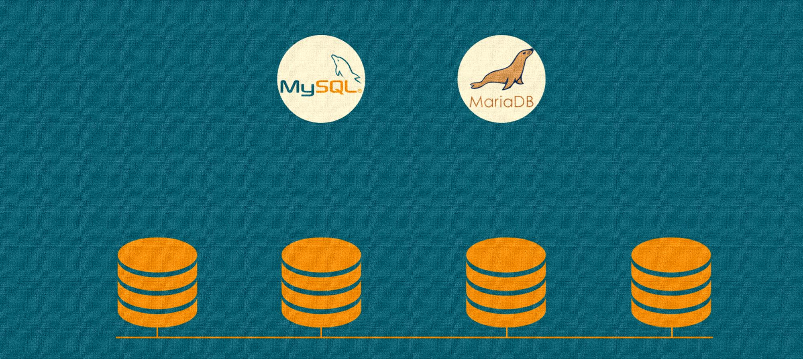

MariaDB Master Slave Galera Cluster Database Replication MySQL Deployment

MariaDB Master/Slave/Active/Backup & Galera HA Cluster Database Replication Deplyment - MySQL VPS/Cloud Server Installation and Configuration (Ubuntu 20 & 22 Lab) - Cloud and Local Ubuntu VM Lab

Test and Try >> Install on Azure/AWS/GCP/Digital-Ocean/UpCloud/Vultr or Any Public Cloud/VPS >> Ubuntu 20 or 22


**********

**MariaDB:**

MariaDB is an open-source relational database management system (RDBMS) that is a fork of MySQL. It was created by the original developers of MySQL after concerns arose over the acquisition of MySQL by Oracle Corporation. MariaDB is designed to be highly compatible with MySQL, meaning that many existing MySQL databases and applications can be migrated to MariaDB with minimal effort.

**Use Cases:**

1. **Web Applications:** MariaDB is commonly used as the backend database for web applications, providing a reliable and scalable storage solution for dynamic websites.

2. **Enterprise Applications:** Many organizations deploy MariaDB for managing their business-critical applications, such as customer relationship management (CRM) and enterprise resource planning (ERP) systems.

3. **Content Management Systems (CMS):** CMS platforms like WordPress, Joomla, and Drupal can utilize MariaDB as their database backend to store and retrieve content.

4. **Data Warehousing:** MariaDB is suitable for data warehousing applications, handling large volumes of data and complex queries efficiently.

5. **Analytics:** Organizations use MariaDB for data analysis and reporting, leveraging its support for complex queries and indexing.

**Advantages:**

1. **Open Source:** MariaDB is released under the GNU General Public License, making it free to use, modify, and distribute. This openness promotes collaboration and community-driven development.

2. **Compatibility:** MariaDB is designed to be highly compatible with MySQL, allowing for a seamless transition for users familiar with MySQL databases.

3. **Performance:** MariaDB often shows improved performance over MySQL in certain scenarios, due in part to its use of the Aria storage engine and other optimizations.

4. **Security Features:** MariaDB includes various security features such as encryption at rest, data masking, and firewall capabilities to enhance data protection.

5. **Active Community:** MariaDB benefits from an active and growing community of developers and users, providing ongoing support, updates, and extensions.

**Port Numbers:**

By default, MariaDB uses the following port numbers:

- **TCP/IP Port:** 3306
- **UDP Port:** 3306

These ports are used for communication between the MariaDB server and client applications. It's worth noting that these default ports can be configured to different values during the installation or in the server configuration file. Always check the specific configuration of your MariaDB installation for accurate port information.

**********

**MariaDB Topologies and Configurations:**

**1. Master-Slave Replication:**

**Advantages:**
- **High Availability:** In the event of a master failure, one of the slaves can be promoted to the new master, ensuring continuous availability.
- **Read Scaling:** Read operations can be distributed among multiple slaves, improving overall read performance.
- **Data Redundancy:** Data is replicated from the master to the slave, providing a level of data redundancy and backup.

**2. Master-Master Replication:**

**Advantages:**
- **Load Balancing:** Both masters can handle read and write operations, distributing the load and improving overall system performance.
- **High Availability:** If one master fails, the other can continue handling both read and write operations, minimizing downtime.
- **Geographic Distribution:** Master-Master replication can be used in geographically distributed setups to improve response times for users in different regions.

**3. Galera Cluster:**

**Advantages:**
- **Synchronous Multi-Master Replication:** Galera Cluster supports synchronous replication, ensuring that data changes are applied to all nodes simultaneously, providing consistency across the cluster.
- **Automatic Node Recovery:** Galera Cluster handles node failures and recoveries automatically, making it resilient to node outages.
- **Read and Write Scaling:** Galera Cluster allows for both read and write scaling, distributing the workload among the nodes.
- **Active-Active Configuration:** All nodes in the cluster are active and can handle both read and write operations, improving resource utilization.

**Common Advantages for MariaDB Topologies:**

1. **Data Redundancy and Availability:** Replication and clustering configurations provide redundancy, ensuring that if one node fails, others can take over, minimizing downtime.

2. **Scalability:** MariaDB topologies allow for horizontal scalability by adding more nodes to distribute the workload and improve performance.

3. **Load Balancing:** Configurations like Master-Master replication distribute the load among multiple nodes, improving overall system performance.

4. **Geographic Distribution:** Master-Master replication and Galera Cluster configurations can be used for setups spanning different geographic locations, improving global accessibility and user experience.

5. **Automatic Failover:** In both Master-Slave and Master-Master configurations, there is a level of automatic failover, ensuring continued operation even in the presence of node failures.

It's important to choose a topology and configuration based on specific use case requirements, such as performance needs, data consistency, and geographic distribution. Each configuration has its strengths and weaknesses, and the choice depends on the goals and constraints of the application architecture.

**********

MariaDB Master Slave Replication Setup Linux Command >> 

First, you will need to install MariaDB on both servers. You can install it by running the following command:
```bash
sudo apt update -y && sudo apt upgrade -y
sudo apt-get install mariadb-server mariadb-client -y
```

After installing MariaDB, run the following command to secure the MariaDB installation:
```bash
sudo mysql_secure_installation
```

Step 2 – Configure Master Server - Next, you will need to enable binary logging and replication on the master server. To do so, open the file /etc/mysql/mariadb.conf.d/50-server.cnf with your preferred text editor:
```bash
sudo vi /etc/mysql/mariadb.conf.d/50-server.cnf
```

Find the line bind-address and change the value to 0.0.0.0 to allow inbound connections.
```bash
bind-address            = 0.0.0.0
```

Next, add the following lines at the end of the file:
```bash
server-id = 1
log_bin = /var/log/mysql/mysql-bin.log
log_bin_index =/var/log/mysql/mysql-bin.log.index
relay_log = /var/log/mysql/mysql-relay-bin
relay_log_index = /var/log/mysql/mysql-relay-bin.index
```

Save and close the file when you are finished. Then, restart the MariaDB service to implement the changes:
```bash
sudo systemctl restart mariadb
```

Next, you will need to create a replication user. The slave server will use this user to log into the master server and request binary logs. First, log in to MariaDB shell with the following command:
```bash
sudo mysql -u root -p
```

Provide your root password when prompted, then create a user with the following command:
```bash
CREATE USER 'replication'@'%' identified by 'your-password';
```

Next, grant the replication slave privilege to this user with the following command:
```bash
GRANT REPLICATION SLAVE ON *.* TO 'replication'@'%';
```

Next, flush the privileges with the following command:
```bash
FLUSH PRIVILEGES;
```

Next, check the master server status with the following command:
```bash
show master status;
show databases;
```

Next, exit from the MariaDB shell with the following command:
```bash
EXIT;
```

Please remember the File and Position details from the above output. You will need these values when configuring the slave server. Step 3 – Configure Slave Server - Next, log in to the slave server and open the file /etc/mysql/mariadb.conf.d/50-server.cnf:
```bash
sudo vi /etc/mysql/mariadb.conf.d/50-server.cnf
```

Find the line bind-address and change the value to 0.0.0.0 as shown below:
```bash
bind-address            = 0.0.0.0
```

Next, add the following lines at the end of the file:
```bash
server-id = 2
log_bin = /var/log/mysql/mysql-bin.log
log_bin_index =/var/log/mysql/mysql-bin.log.index
relay_log = /var/log/mysql/mysql-relay-bin
relay_log_index = /var/log/mysql/mysql-relay-bin.index
```

Save and close the file when you are finished. Then, restart the MariaDB service to implement the changes:
```bash
sudo systemctl restart mariadb
```

Next, log in to the MariaDB shell with the following command:
```bash
sudo mysql -u root -p
```

Provide your root password when prompted, then stop the slave threads as shown below:
```bash
stop slave;
```

Next, run the following command to set up the slave to replicate the master:
```bash

CHANGE MASTER TO MASTER_HOST = 'your-master-host-ip', MASTER_USER = 'replication', MASTER_PASSWORD = 'your-password', MASTER_LOG_FILE = 'mysql-bin.000001', MASTER_LOG_POS = 313;

CHANGE MASTER TO MASTER_HOST = '52.151.249.160', MASTER_USER = 'replication', MASTER_PASSWORD = 'your-password', MASTER_LOG_FILE = 'mysql-bin.000001', MASTER_LOG_POS = 785;

CHANGE MASTER TO MASTER_HOST = '192.168.56.10', MASTER_USER = 'replication', MASTER_PASSWORD = 'your-password', MASTER_LOG_FILE = 'mysql-bin.000001', MASTER_LOG_POS = 785;

```

Next, start the slave threads and exit from the MariaDB shell as shown below:
```bash
start slave;
exit;
```

Amend the above command to use your master host IP address and your password which you created in previous steps. Please use the log file name and position values that you obtained from the master server. Step 4 – Test Database Replication - At this point, you have configured master-slave replication. Now, it’s time to test replication between master to slave. On the master server, log in to the MariaDB shell with the following command:
```bash
sudo mysql -u root -p
```

Provide your root password when prompted, then create a database with name mydb as shown below:
```bash
create database mydb;
```

Next, create a table with name “products” inside the mydb database:
```bash
use mydb;
CREATE TABLE products(product_id INT NOT NULL AUTO_INCREMENT,product_name VARCHAR(100) NOT NULL,product_manufacturer VARCHAR(40) NOT NULL,submission_date DATE,PRIMARY KEY ( product_id ));
```

On the slave server, log in to the MariaDB shell with the following command:
```bash
sudo mysql -u root -p
```

Provide your root password when prompt then check the slave status:
```bash
SHOW SLAVE STATUS \G
```

If you have any problem >> Dont forget to allow tcp port 3306 on VPS/Cloud servers! Next, run the following command to check whether the database is replicated:
```bash
show databases;
```

Next, check the product table that you created on the master server:
```bash
use mydb;
show tables;
```

Congratulations! Your MariaDB master-slave replication is working as expected. You can now easily recover your database in the event of a failure.

**********
MariaDB Master to Master Configuration Linux Command >>

Step 1 – Configure hosts and DNS - Set the hostnames of the servers.
```bash
sudo hostnamectl set-hostname master1
sudo hostnamectl set-hostname master2
```

Then proceed and add the servers to the list of known hosts(on both servers)
```bash
sudo vi /etc/hosts
```

Example IP and hostname >> /etc/hosts
```bash
40.124.184.77	master1
20.163.79.106	master2

192.168.56.10	master1
192.168.56.11	master2

```

From Master Node 1, try ping Master Node 2 as below.
```bash
ping master2
```

Now update all the servers to the latest stable packages.
```bash
sudo apt update && sudo apt upgrade -y
```

Reboot if required.
```bash
sudo reboot
```

Step 2 – Configure Chrony NTP synchronization - The time between the two MariaDB master nodes must be synchronized. Install Chrony NTP packages on the servers.
```bash
sudo apt -y install chrony
```

Once installed, start and enable Chrony
```bash
sudo systemctl enable --now chrony
sudo timedatectl set-ntp yes
```

Verify if the time has been synchronized.
```bash
timedatectl 
```

Step 3 – Install MariaDB on both servers - Now we will ensure that both servers have MariaDB installed. First, install the required packages.
```bash
sudo apt install curl software-properties-common -y
```

In this guide, we will install MariaDB on both Ubuntu servers from the default repositories
```bash
sudo apt update -y
sudo apt install mariadb-server mariadb-client -y
```

With MariaDB installed successfully Start and enable it.
```bash
sudo systemctl enable --now mariadb.service
```

Verify the installation by logging in to the MariaDB shell as below. Provide the default password: root
```bash
sudo mysql -u root -p
exit
```

Allow TCP/UDP Ports >> VPS or Cloud Server and UFW if enabled >> TCP(3306,4567,4568,4444) & UDP(4567) >> MariaDB_Master_Master_Replication
```bash
sudo ufw allow 3306/tcp
sudo ufw allow 4567/tcp
sudo ufw allow 4568/tcp
sudo ufw allow 4444/tcp
sudo ufw allow 4567/udp
sudo ufw status
```

Step 4 – Configure MariaDB for Master-Master Replication - Now we need to edit our master nodes to enable replication. On master node 1, we will edit the config file below.
```bash
sudo vi /etc/mysql/mariadb.conf.d/50-server.cnf
```

At the end of the file, add the below information.
```bash
bind-address         = 40.124.184.77
server-id            = 1
log_bin              = /var/log/mysql/mysql-bin.log
expire_logs_days     = 10
max_binlog_size      = 100M
# binlog_do_db       = replica
# binlog_ignore_db   = exclude_database_name
```

Replace the bind address with the IP_address of your Master node 1 and replica, with the database to replicate. Save the file and restart MariaDB.
```bash
sudo systemctl restart mariadb
```

Now login to the MariaDB instance
```bash
sudo mysql -u root -p
```

Create a master user and the required grants.
```bash
CREATE USER 'master_user1'@'%' IDENTIFIED BY 'Passw0rd';
GRANT REPLICATION SLAVE ON *.* TO 'master_user1'@'%';
FLUSH PRIVILEGES;
```

Remember to replace master_user with your desired username and Passw0rd with your preferred password for the user. Check the status to show the current binary log and the exact location where the master should start replication from.
```bash
SHOW MASTER STATUS;
```

Remember, the position of the file is important as it will be required later in this configuration. On Master Node 2 - Now on the other node, Master Node 2, we will do a similar configuration as above. Edit the config file as below.
```bash
sudo vi /etc/mysql/mariadb.conf.d/50-server.cnf
```

In the file, add the below lines replacing them appropriately.
```bash
bind-address		   = 20.163.79.106
server-id		      = 2
log_bin			      = /var/log/mysql/mysql-bin.log
expire_logs_days     = 10
max_binlog_size		= 100M
# binlog_do_db	      = replica
# binlog_ignore_db   = exclude_database_name
```

Replace the bind address with the IP_address of Master Node 2. Save the file and restart MariaDB.
```bash
sudo systemctl restart mariadb
```

Log into the MariaDB shell.
```bash
sudo mysql -u root -p
```

Also here, create the master user with the necessary privileges.
```bash
CREATE USER 'master_user1'@'%' IDENTIFIED BY 'Passw0rd';
GRANT REPLICATION SLAVE ON *.* TO 'master_user1'@'%';
FLUSH PRIVILEGES;
```

Now in the next step, we need to add the information from Master Node 1 to our Master node 2. First, stop the slave.
```bash
STOP SLAVE;
```

Now proceed and add the Master Node 1 information.
```bash
CHANGE MASTER TO MASTER_HOST = "master1", MASTER_USER = "master_user1", MASTER_PASSWORD = "Passw0rd", MASTER_PORT=3306, MASTER_LOG_FILE = "mysql-bin.000001", MASTER_LOG_POS = 328, MASTER_CONNECT_RETRY=10;

CHANGE MASTER TO MASTER_HOST = "master1", MASTER_USER = "master_user1", MASTER_PASSWORD = "Passw0rd", MASTER_PORT=3306, MASTER_LOG_FILE = "mysql-bin.000003", MASTER_LOG_POS = 796, MASTER_CONNECT_RETRY=10;

```

The details provided here are details for the Master Node 1, Replace mysql-bin.000001 with the path of the file and 782 with the position of the file on Master Node 1. Now start the slave.
```bash
START SLAVE;
```

Show the Master status and also take note of the path and position of the file.
```bash
SHOW MASTER STATUS;
```

Complete the Master-Master Replication setup on Master Node 1. Now we need to complete the setup by adding the Master Node 2 information to our Master node 1. While logged in to the MariaDB shell on Master node 1. Stop the replication.
```bash
STOP SLAVE;
```

Now on Master node 1 add the information for Master Node 2.
```bash
CHANGE MASTER TO MASTER_HOST = "master2", MASTER_USER = "master_user1", MASTER_PASSWORD = "Passw0rd", MASTER_PORT=3306, MASTER_LOG_FILE = "mysql-bin.000001", MASTER_LOG_POS = 328, MASTER_CONNECT_RETRY=10;

CHANGE MASTER TO MASTER_HOST = "master2", MASTER_USER = "master_user1", MASTER_PASSWORD = "Passw0rd", MASTER_PORT=3306, MASTER_LOG_FILE = "mysql-bin.000002", MASTER_LOG_POS = 622, MASTER_CONNECT_RETRY=10;

```

Replace the provided details appropriately and proceed as below.
```bash
START SLAVE;
```

Verify the slave status on any node.
```bash
show slave status\G
```

If error connecting to master >> Change the bind ip address config from real ip address to 0.0.0.0 and restart the service!
```bash
cat /etc/mysql/mariadb.conf.d/50-server.cnf
sudo vi /etc/mysql/mariadb.conf.d/50-server.cnf
```

```bash
bind-address          = 0.0.0.0
```

```bash
sudo systemctl restart mariadb
```

On both nodes, the service should be waiting for the other to send an event as shown above. Step 5 – Test the MariaDB Master-Master replication - Now that we have successfully completed all the required configurations, we need to test if the setup is working correctly. On Master node 2: On the MariaDB shell on Master Node 2, create the replication database(replica) and a new table in it.
```bash
create database replica;
CREATE TABLE replica.test (`name` varchar(18));
show databases;
```

On Master node 1: Show the database and table in the replica database
```bash
SHOW TABLES IN replica;
```

Create a test table >>
```bash
create database replica2;
create table replica2.test (`name` varchar(18));
show tables in replica2;
```

Create a database and test table >>
```bash
create database replica3;
create table replica3.test (`name` varchar(18));
show databases;
show tables in replica3;
```

Create a Test Script >>
```bash
sudo vi replica4test.sh
```

Bash Script >>
```bash
#!/bin/bash
# MySQL connection details
MYSQL_HOST="localhost"
MYSQL_USER="root"
MYSQL_PASSWORD="P@ssw0rd"
MYSQL_DATABASE="replica4"
# SQL script content
SQL_SCRIPT=$(cat <<EOL
CREATE DATABASE IF NOT EXISTS $MYSQL_DATABASE;
USE $MYSQL_DATABASE;
CREATE TABLE IF NOT EXISTS test (
    name VARCHAR(18)
);
EOL
)
# Execute SQL script using the mysql command
echo "$SQL_SCRIPT" | mysql -h $MYSQL_HOST -u $MYSQL_USER -p$MYSQL_PASSWORD
# Check if the command was successful
if [ $? -eq 0 ]; then
    echo "Database $MYSQL_DATABASE and table test created successfully!"
else
    echo "Error creating database and table. Check your MySQL connection details and try again."
fi
```

Run the Bash Script >>
```bash
sudo bash replica4test.sh
```

Create Another Bash Script >>
```bash
sudo vi replica4test_insert_data.sh
```

Bash Script >>
```bash
#!/bin/bash
# MySQL connection details
MYSQL_HOST="localhost"
MYSQL_USER="root"
MYSQL_PASSWORD="P@ssw0rd"
MYSQL_DATABASE="replica4"
# Number of random names to insert
NUM_NAMES=1000
# Generate and insert random names
for ((i = 1; i <= NUM_NAMES; i++)); do
    # Generate a random name (replace with your own logic)
    RANDOM_NAME=$(cat /dev/urandom | tr -dc 'a-zA-Z' | fold -w 8 | head -n 1)
    # SQL script content for insertion
    INSERT_SQL="INSERT INTO test (name) VALUES ('$RANDOM_NAME');"
    # Execute SQL script using the mysql command
    echo "$INSERT_SQL" | mysql -h $MYSQL_HOST -u $MYSQL_USER -p$MYSQL_PASSWORD $MYSQL_DATABASE
done
# Check if the command was successful
if [ $? -eq 0 ]; then
    echo "Inserted $NUM_NAMES random names into the test table successfully!"
else
    echo "Error inserting data. Check your MySQL connection details and try again."
fi
```

Run the Bash Script >>
```bash
sudo bash replica4test_insert_data.sh
```

Check the database and table for records on both servers >>
```bash
select count(name) from replica4.test;
```

**********

MariaDB Galera Cluster Deployment - Ubuntu HA Configuration (Ports = TCP 3306,4567,4568,4444 & UDP 4567) - Top features of MariaDB Galera Cluster are:
- It provides active-active multi-master topology
- You can read and write to any cluster node
- It has automatic node joining
- Automatic membership control, failed nodes drop from the cluster
- Has true parallel replication, on row level
- Direct client connections
- From these features, you get the benefits like no loss in transactions or weird slave lag normally seen in database replication since all servers have up-to-date data. By using MariaDB Galera Cluster on Ubuntu server, you also get scalability for both reads and writes with small latencies from connecting clients.
- To get fair load balancing based on Roundrobin or least number of connections on the servers, we will make use of HAProxy which is a production-grade open source Load Balancer.
- When setting up MariaDB Galera Cluster, It is advisable to have an odd number of servers. Minimum being three servers.

Update and Installation Linux Command on All 3 Servers/Nodes >>
```bash
sudo apt-get update -y
sudo apt-get install mariadb-server -y
sudo systemctl start mariadb
sudo systemctl status mariadb
sudo mysql_secure_installation
```

Allow TCP/UDP Ports >> VPS or Cloud Server and UFW if enabled >> TCP(3306,4567,4568,4444) & UDP(4567) >> MariaDB_Master_Master_Replication
```bash
sudo ufw allow 22/tcp
sudo ufw allow 3306/tcp
sudo ufw allow 4567/tcp
sudo ufw allow 4568/tcp
sudo ufw allow 4444/tcp
sudo ufw allow 4567/udp
sudo ufw status
sudo ufw enable
sudo ufw status
```

On All Nodes/Servers (1 to 3):
```bash
sudo systemctl stop mariadb
```

First Node/Server:
```bash
sudo vi /etc/mysql/conf.d/galera.cnf
```

First Node/Server Config:
```bash
[mysqld]
binlog_format=ROW
default-storage-engine=innodb
innodb_autoinc_lock_mode=2
bind-address=0.0.0.0
# Galera Provider Configuration
wsrep_on=ON
wsrep_provider=/usr/lib/galera/libgalera_smm.so
# Galera Cluster Configuration
wsrep_cluster_name="galera_cluster"
# wsrep_cluster_address="gcomm://51.103.208.251,51.103.209.14,51.103.209.125"
wsrep_cluster_address="gcomm://192.168.56.10,192.168.56.11,192.168.56.12"
# Galera Synchronization Configuration
wsrep_sst_method=rsync
# Galera Node Configuration
# wsrep_node_address="51.103.208.251"
wsrep_node_address="192.168.56.10"
wsrep_node_name="mygal1"
```

First Node/Server:
```bash
sudo systemctl stop mariadb
```

Second Node/Server:
```bash
sudo vi /etc/mysql/conf.d/galera.cnf
```

Second Node/Server Config:
```bash
[mysqld]
binlog_format=ROW
default-storage-engine=innodb
innodb_autoinc_lock_mode=2
bind-address=0.0.0.0
# Galera Provider Configuration
wsrep_on=ON
wsrep_provider=/usr/lib/galera/libgalera_smm.so
# Galera Cluster Configuration
wsrep_cluster_name="galera_cluster"
# wsrep_cluster_address="gcomm://51.103.208.251,51.103.209.14,51.103.209.125"
wsrep_cluster_address="gcomm://192.168.56.10,192.168.56.11,192.168.56.12"
# Galera Synchronization Configuration
wsrep_sst_method=rsync
# Galera Node Configuration
# wsrep_node_address="51.103.209.14"
wsrep_node_address="192.168.56.11"
wsrep_node_name="mygal2"
```

Third Node/Server:
```bash
sudo vi /etc/mysql/conf.d/galera.cnf
```

Third Node/Server Config:
```bash
[mysqld]
binlog_format=ROW
default-storage-engine=innodb
innodb_autoinc_lock_mode=2
bind-address=0.0.0.0
# Galera Provider Configuration
wsrep_on=ON
wsrep_provider=/usr/lib/galera/libgalera_smm.so
# Galera Cluster Configuration
wsrep_cluster_name="galera_cluster"
# wsrep_cluster_address="gcomm://51.103.208.251,51.103.209.14,51.103.209.125"
wsrep_cluster_address="gcomm://192.168.56.10,192.168.56.11,192.168.56.12"
# Galera Synchronization Configuration
wsrep_sst_method=rsync
# Galera Node Configuration
# wsrep_node_address="51.103.209.125"
wsrep_node_address="192.168.56.12"
wsrep_node_name="mygal3"
```


On First Node/Server:
```bash
sudo galera_new_cluster
sudo mysql -u root -p -e "SHOW STATUS LIKE 'wsrep_cluster_size'"
```

On Second/Third Node:
```bash
sudo systemctl start mariadb
sudo mysql -u root -p -e "SHOW STATUS LIKE 'wsrep_cluster_size'"
```

On First Node to Test:
```bash
sudo mysql -u root -p
show databases;
create database db1;
show databases;
```

On Second Node:
```bash
create database db2;
show databases;
```

On Third Node:
```bash
create database db3;
show databases;
```

If everything was set correctly, you can start testing.
```bash
sudo journalctl -xeu mariadb.service
```

**********

Swap Configuration on Ubuntu 20 or 22 - Linux Command >>
```bash
sudo apt update -y && sudo apt upgrade -y
sudo lsb_release -a
sudo apt install screen -y
sudo fallocate -l 4G /swapfile
ls -anp /swapfile
sudo chmod 600 /swapfile
sudo mkswap /swapfile
sudo swapon /swapfile
echo '/swapfile none swap sw 0 0' | sudo tee -a /etc/fstab
```

**********

VB and Vagrant Installation on Ubuntu 22 - Linux Command >>
```bash
sudo apt update -y && sudo apt upgrade -y
wget https://www.virtualbox.org/download/oracle_vbox_2016.asc
cat oracle_vbox_2016.asc | gpg --dearmor | sudo tee /usr/share/keyrings/virtualbox.gpg > /dev/null 2>&1
echo 'deb [arch=amd64 signed-by=/usr/share/keyrings/virtualbox.gpg] https://download.virtualbox.org/virtualbox/debian jammy contrib' | sudo tee -a /etc/apt/sources.list.d/virtualbox.list
sudo apt update && sudo apt install virtualbox-7.0 -y
wget -O- https://apt.releases.hashicorp.com/gpg | sudo gpg --dearmor -o /usr/share/keyrings/hashicorp-archive-keyring.gpg
echo "deb [signed-by=/usr/share/keyrings/hashicorp-archive-keyring.gpg] https://apt.releases.hashicorp.com $(lsb_release -cs) main" | sudo tee /etc/apt/sources.list.d/hashicorp.list
sudo apt update && sudo apt install vagrant -y
```

```bash
sudo vi Vagrantfile
```

```bash
Vagrant.configure("2") do |config|
    config.vm.define "ubuntu1" do |node|
        node.vm.box = "generic/ubuntu2204"
        node.vm.hostname = "ubuntu1"
        config.vm.network "public_network"
        config.vm.provider "virtualbox" do |vb|
            vb.gui = false
            vb.memory = "1024"
        end
    end
end
```

```bash
Vagrant.configure("2") do |config|
    config.vm.define "ubuntu1" do |node|
        node.vm.box = "generic/ubuntu2204"
        node.vm.hostname = "ubuntu1"
        config.vm.network "public_network"
        config.vm.provider "virtualbox" do |vb|
            vb.gui = false
            vb.memory = "1024"
        end
    end
    config.vm.define "ubuntu2" do |node|
        node.vm.box = "generic/ubuntu2204"
        node.vm.hostname = "ubuntu2"
        config.vm.network "public_network"
        config.vm.provider "virtualbox" do |vb|
            vb.gui = false
            vb.memory = "1024"
        end
    end
    config.vm.define "ubuntu3" do |node|
        node.vm.box = "generic/ubuntu2204"
        node.vm.hostname = "ubuntu3"
        config.vm.network "public_network"
        config.vm.provider "virtualbox" do |vb|
            vb.gui = false
            vb.memory = "1024"
        end
    end
end
```

```bash
cat Vagrantfile
```

```bash
vagrant help
vagrant global-status
vagrant up
vagrant ssh [ID]
vagrant destroy [ID]
```

Installation/Download URL Links (Windows/Linux/Mac):
- Virtual-Box >> https://www.virtualbox.org/wiki/Downloads
- Vagrant >> https://developer.hashicorp.com/vagrant/install
- VMware Player >> https://www.vmware.com/nl/products/workstation-player/workstation-player-evaluation.html
- Ubuntu Download Link >> https://releases.ubuntu.com/jammy/


URLs:

https://github.com/xyzsre/

https://www.virtualbox.org/wiki/Downloads

https://www.vmware.com/products/desktop-hypervisor/workstation-and-fusion

https://docs.docker.com/desktop/setup/install/windows-install/

https://ubuntu.com/download/desktop

https://developer.hashicorp.com/vagrant/install#linux

https://developer.hashicorp.com/vagrant/install#windows

https://developer.hashicorp.com/vagrant/install#darwin


Cloud::

https://aws.amazon.com/free/

https://azure.microsoft.com/en-us/pricing/purchase-options/azure-account

https://cloud.google.com/free?hl=en

https://www.linode.com/lp/free-credit-100-5000/

https://www.vultr.com/promo/try250/

https://upcloud.com/


MariaDB::

https://mariadb.com/docs

https://mariadb.com/docs/galera-cluster


